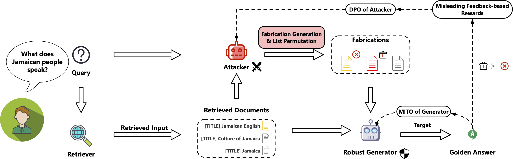

# 🏧 ATM-RAG

<a href="https://arxiv.org/abs/2405.18111">

</a>
<a href="https://www.apache.org/licenses/LICENSE-2.0">

</a>
<a href="https://pytorch.org">
=2.1.2">
<a href="https://blog.vllm.ai/2023/06/20/vllm.html">
=0.3.0">
</a>


Code for paper

> [**ATM: Adversarial Tuning Multi-agent System Makes a Robust Retrieval-Augmented Generator [EMNLP 2024]**](https://aclanthology.org/2024.emnlp-main.610)   
> *Junda Zhu, Lingyong Yan, Haibo Shi, Dawei Yin, Lei Sha* 

which is aimed at enhancing the robustness of RAG system against LLM-generated content through adversarial iterative optimization.



## News:
* Sept 20, 2024: ATM is accepted by EMNLP 2024 Main Conference
* May 28, 2024: ATM is publicly available at [arxiv](https://arxiv.org/abs/2405.18111)

## Data Format:
We require a user query (question) along with its corresponding reference answer. Retrieved or generated contexts (ctxs) serve as open-book documents.

```json
{
  "question":"What is George Rankin's occupation?",
  "answers":["politician", "political leader", "political figure", "polit.", "pol"],
  "ctxs":[
    {"hasanswer":true,"id":"15165852","score":"1.615642","text":"appealed for support as a tribute to their fathers. Feilden was re-elected at the 1874 general election, and held the seat until his death in 1875 aged 57. Henry Feilden (Conservative politician) Henry Master Feilden (21 February 1818 \u2013 5 September 1875) was an English Conservative Party politician. On 16 March 1869, the result of the 1868 general election in the borough of Blackburn was declared null and void, after an election petition had been lodged. The two Conservatives who had been elected, William Henry Hornby and Feilden's father Joseph Feilden, were unseated when Mr Justice Willes found that there","title":"Henry Feilden (Conservative politician)"},
    {"hasanswer":true,"id":"15165851","score":"1.5857865","text":"Henry Feilden (Conservative politician) Henry Master Feilden (21 February 1818 \u2013 5 September 1875) was an English Conservative Party politician. On 16 March 1869, the result of the 1868 general election in the borough of Blackburn was declared null and void, after an election petition had been lodged. The two Conservatives who had been elected, William Henry Hornby and Feilden's father Joseph Feilden, were unseated when Mr Justice Willes found that there had been widespread intimidation of voters. Henry Feilden was elected at the resulting by-election on 31 March 1869, along with William Henry Hornby's son Edward. Both candidates had","title":"Henry Feilden (Conservative politician)"},
    ...
    {"hasanswer":false,"id":"14398759","score":"1.5703722","text":"Feilden married Julia, daughter of Judge David James McCord (1797\u20131855) of South Carolina. In 1880 Feilden settled in Wells-next-the-Sea, Norfolk. Feilden joined the Norfolk and Norwich Naturalists' Society in 1880 and became President in 1885. He lived in Norfolk for over 20 years, moving to Burwash, Sussex in 1902. One of his discoveries in 1888 was a stuffed specimen of the Great Bustard which had been shot in Norfolk. Feilden contributed to \"Transactions of the Norfolk and Norwich Naturalists' Society\" and submitted scientific papers to \"The Zoologist\" and \"Ibis\" (the journal of the British Ornithologists' Union, to which he was","title":"Henry Wemyss Feilden"}
  ]
}

```


## Step-by-step Instructions  

### 0. Document Retrieval and Test Data Building

For document retrieval, you can refer to the [Contriever repository](https://github.com/facebookresearch/contriever) for document retrieval or build your own knowledge base to obtain reference documents for a given question.

As for building the test data with strong Fabricators, you can refer to the command:
```shell
mkdir /path/to/input/datasets/test_data_with_fabs

mkdir /path/to/input/datasets/test_data_with_fabs/ask_output

python build_ask_gpt.py \
    --model_name /path/to/input/pretrained_models/Mixtral-8x7B-Instruct-v0.1/ \
    --world_size 4 \
    --ds_name nq \
    --dest_dir /path/to/input/datasets/test_data_with_fabs/ask_output \
    
python fab_merge.py \
    --model_name /path/to/input/pretrained_models/Mixtral-8x7B-Instruct-v0.1/ \
    --ds_name nq \
    --dest_dir /path/to/input/datasets/test_data_with_fabs
```
  
### 1. Initial tuning of Generator
  
For list perturbation, you can refer to `shuffle.py` to enhance Generator's robustness against sorting order. In our experiment, DeepSpeed is utilized for full-parameter fine-tuning.

For building data arrows:

```shell
python generator_sft_data_prepare.py
```

For training:

```shell
OMP_NUM_THREADS=1 deepspeed --hostfile='hosts.cfg' train.py \
    --model_name_or_path atm_7b \
    --train_data /path/to/input/datasets/arrows \
    --per_device_train_batch_size 2 \
    --per_device_eval_batch_size 8 \
    --gradient_accumulation_steps 4  \
    --bf16 \
    --deepspeed_file ./ds_cfg.json \
    --output_dir ./experiments/ \
    --lr_scheduler_type cosine \
    --num_train_epochs 1 \
    --learning_rate 5e-6
```
    
### 2. Attacker DPO Optimization

First use your ATM Generator to inference the PPL given documents/fabrications, which will be utilized as preference label for DPO.

```shell
epoch_suffix=${1}

jsonl_root=/path/to/input/datasets/attacker_train_fab_${epoch_suffix}
csv_root=/path/to/input/datasets/attacker_train_fab_${epoch_suffix}/ask_output

cd ppl_infer

torchrun --nnodes=1 --nproc_per_node=4 \
    ppl_infer_with_trainer.py \
    --model_name_or_path /path/to/input/pretrained_models/atm_generator_${epoch_suffix} \
    --input_file ${jsonl_root}/${ds_name}_fab_for_ppl.jsonl \
    --per_device_eval_batch_size 32 \
    --output ${csv_root}/${ds_name}_score.csv
```

After the score is calculated, build DPO pair-wise data:

```shell
epoch_suffix=${1}
ds_name=${2}

jsonl_root=/path/to/input/datasets/attacker_train_fab_${epoch_suffix}
csv_root=/path/to/input/datasets/attacker_train_fab_${epoch_suffix}/ask_output

mkdir /path/to/input/datasets/attacker_train_fab_${epoch_suffix}/dpo/

python build_compare_dpo_data.py \
    --input_score ${csv_root}/${ds_name}_score.csv \
    --input_docs ${csv_root}/${ds_name}_fab.csv \
    --ds_name $ds_name \
    --output /path/to/input/datasets/attacker_train_fab_${epoch_suffix}/dpo/${ds_name}_dpo.jsonl

```

Start DPO training:

```shell
accelerate launch --config_file ./acc.yaml --main_process_port 2950 train_dpo.py \
    --model_name_or_path /path/to/input/pretrained_models/atm_attacker_${epoch_suffix}/ \
    --train_data /path/to/input/datasets/attacker_train_fab_${epoch_suffix}/dpo/${ds_name}_dpo.jsonl \
    --gradient_accumulation_steps 4 \
    --gradient_checkpointing \
    --learning_rate 8e-7 \
    --lr_scheduler_type cosine \
    --num_train_epochs 1 \
    --output_dir ./experiments \
    --per_device_train_batch_size 2 \
    --per_device_eval_batch_size 2 \
    --max_length 4096 \
    --max_prompt_length 3072
```


### 3. Generator MITO Training

`adv_${epoch_suffix}.jsonl` is merged from the fabrications of current epoch together with retrieved documents, refer to `fab_merge.py` to merge your training data.

```shell
accelerate launch --main_process_port 2950 --config_file ./acc.yaml train_with_mito.py \
    --model_name_or_path /path/to/input/pretrained_models/atm_generator_${epoch_suffix}/ \
    --train_data /path/to/input/datasets/atm_train_data/adv_${epoch_suffix}.jsonl \
    --beta 0.2 \
    --gradient_accumulation_steps 4 \
    --max_steps 100 \
    --gradient_checkpointing \
    --lr_scheduler_type cosine \
    --num_train_epochs 1 \
    --output_dir ./experiments \
    --per_device_train_batch_size 2 \
    --per_device_eval_batch_size 2 \
    --max_length 4096 \
    --max_prompt_length 4096 \ 
```

Then return to Step.2 for the next Iteration, use `epoch_suffix` to control data loading at different stages.

## Acknowledgement
* Llama: <a href="https://github.com/facebookresearch/llama"> https://github.com/facebookresearch/llama</a>
* Mistral: <a href="https://github.com/mistralai">https://github.com/mistralai</a>
* Transformers: <a href="https://github.com/huggingface/transformers">https://github.com/huggingface/transformers</a>
* Contriever: <a href="https://github.com/facebookresearch/contriever">https://github.com/facebookresearch/contriever</a>
* DeepSpeed: <a href="https://github.com/microsoft/DeepSpeed">https://github.com/microsoft/DeepSpeed</a>
* RetRobust: <a href="https://github.com/oriyor/ret-robust">https://github.com/oriyor/ret-robust</a>
* accelerate: <a href="https://github.com/huggingface/accelerate">https://github.com/huggingface/accelerate</a>
* vLLM: <a href="https://github.com/vllm-project/vllm">https://github.com/vllm-project/vllm</a>
* Flash Attention: <a href="https://github.com/Dao-AILab/flash-attention">https://github.com/Dao-AILab/flash-attention</a>
* Self-RAG: <a href="https://github.com/AkariAsai/self-rag">https://github.com/AkariAsai/self-rag</a>
* REAR: <a href="https://github.com/yhao-wang/REAR">https://github.com/yhao-wang/REAR</a>
* RAAT: <a href="https://github.com/calubkk/RAAT">https://github.com/calubkk/RAAT</a>


## Citation
If you find this repository useful, please cite our paper:
```
@inproceedings{zhu-etal-2024-atm,
    title = "{ATM}: Adversarial Tuning Multi-agent System Makes a Robust Retrieval-Augmented Generator",
    author = "Zhu, Junda  and
      Yan, Lingyong  and
      Shi, Haibo  and
      Yin, Dawei  and
      Sha, Lei",
    editor = "Al-Onaizan, Yaser  and
      Bansal, Mohit  and
      Chen, Yun-Nung",
    booktitle = "Proceedings of the 2024 Conference on Empirical Methods in Natural Language Processing",
    month = nov,
    year = "2024",
    address = "Miami, Florida, USA",
    publisher = "Association for Computational Linguistics",
    url = "https://aclanthology.org/2024.emnlp-main.610",
    pages = "10902--10919",
    abstract = "Large language models (LLMs) are proven to benefit a lot from retrieval-augmented generation (RAG) in alleviating hallucinations confronted with knowledge-intensive questions. RAG adopts information retrieval techniques to inject external knowledge from semantic-relevant documents as input contexts. However, due to today{'}s Internet being flooded with numerous noisy and fabricating content, it is inevitable that RAG systems are vulnerable to these noises and prone to respond incorrectly. To this end, we propose to optimize the retrieval-augmented Generator with a Adversarial Tuning Multi-agent system **(ATM)**. The ATM steers the Generator to have a robust perspective of useful documents for question answering with the help of an auxiliary Attacker agent. The Generator and the Attacker are tuned adversarially for several iterations. After rounds of multi-agent iterative tuning, the Generator can eventually better discriminate useful documents amongst fabrications. The experimental results verify the effectiveness of ATM and we also observe that the Generator can achieve better performance compared to state-of-the-art baselines.",
}
```